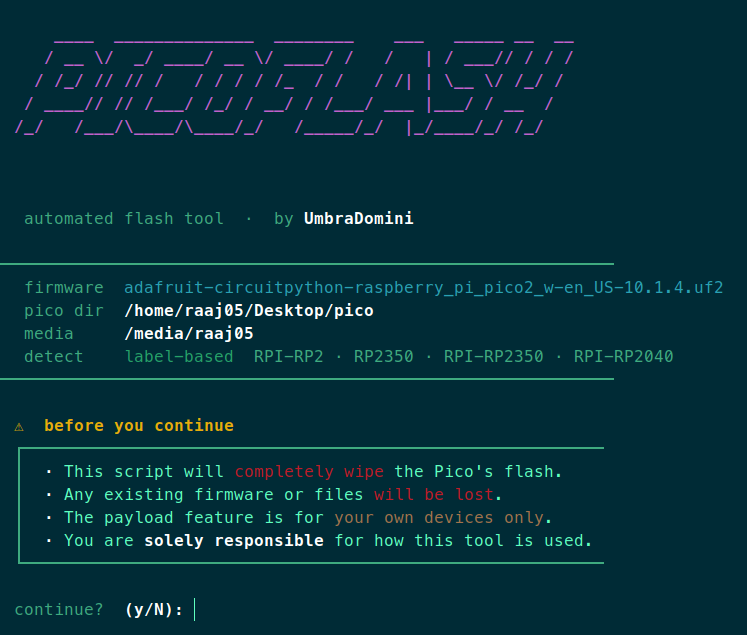
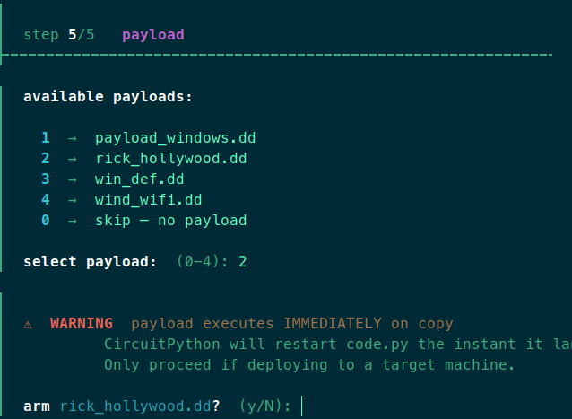

# pico-flash

> Automated flash tool for [pico-ducky](https://github.com/dbisu/pico-ducky) on Linux.  
> Wipes, flashes CircuitPython, copies project files, and optionally arms a payload — in one command.  
> One-time setup. Run forever.

---

## What it does

Flashing a Pico for pico-ducky manually means: holding BOOTSEL, copying a nuke file, waiting for remount, copying CircuitPython, waiting again, copying lib files and scripts, then copying the payload. Every time.

This script automates all of it across 5 steps:

1. **Detect** — waits for the Pico to appear in BOOTSEL mode
2. **Wipe** — copies `flash_nuke.uf2` to fully erase flash
3. **Flash** — installs CircuitPython automatically (auto-detects the `.uf2` in your pico dir)
4. **Copy files** — copies your pico-ducky project files to `CIRCUITPY`
5. **Payload** — interactive picker to arm a `.dd` payload (with a confirmation prompt)

Supports all current Pico variants: **Pico**, **Pico W**, **Pico 2**, **Pico 2 W**.

---

## Requirements

- **Linux only** (Ubuntu, Fedora, Arch, etc.)
- `bash` 4+
- `lsblk` — mount detection (standard on all major distros)
- `udisksctl` — clean eject (part of `udisks2`, standard on desktop Linux)
- `findmnt` — eject logic (part of `util-linux`, standard everywhere)

> On first run the script auto-installs a udev rule (`/etc/udev/rules.d/99-pico.rules`) so the Pico mounts as writable without sudo. This requires a one-time `sudo` prompt.

---

## Setup

Follow these steps in order before running the script for the first time.

---

### Step 1 — Clone this repo

```bash
git clone https://github.com/Umbra-Domini/pico-flash.git ~/Desktop/pico-flash
cd ~/Desktop/pico-flash
chmod +x pico_flash.sh
```

> ⚠ The `chmod +x` step is required. Without it you will get `Permission denied` when trying to run the script.

---

### Step 2 — Download flash_nuke.uf2

This file fully erases the Pico's flash before writing new firmware. Without it the script will not run.

→ [Download flash_nuke.uf2](https://datasheets.raspberrypi.com/soft/flash_nuke.uf2)

Place it at: `~/Desktop/pico-flash/flash_nuke.uf2`

---

### Step 3 — Download CircuitPython firmware

Download the `.uf2` for your specific board and place it in the repo folder. The script auto-detects it by filename — do not rename the file.

| Board | Download |
|-------|----------|
| Raspberry Pi Pico | [circuitpython.org/board/raspberry_pi_pico](https://circuitpython.org/board/raspberry_pi_pico/) |
| Raspberry Pi Pico W | [circuitpython.org/board/raspberry_pi_pico_w](https://circuitpython.org/board/raspberry_pi_pico_w/) |
| Raspberry Pi Pico 2 | [circuitpython.org/board/raspberry_pi_pico2](https://circuitpython.org/board/raspberry_pi_pico2/) |
| Raspberry Pi Pico 2 W | [circuitpython.org/board/raspberry_pi_pico2_w](https://circuitpython.org/board/raspberry_pi_pico2_w/) |

Place it at: `~/Desktop/pico-flash/adafruit-circuitpython-raspberry_pi_pico2_w-en_US-x.x.x.uf2`

---

### Step 4 — Download the Adafruit CircuitPython Bundle

The lib folder needs several libraries from Adafruit's bundle.

→ [Download the latest bundle (adafruit-circuitpython-bundle-x.x-mpy-YYYYMMDD.zip)](https://github.com/adafruit/Adafruit_CircuitPython_Bundle/releases/latest)

Extract the zip, then copy these from the bundle's `lib/` folder into `~/Desktop/pico-flash/needed_files/lib/`:

| File / Folder | What it does |
|---------------|--------------|
| `adafruit_hid/` | HID keyboard/mouse emulation — core of all keystroke injection |
| `adafruit_debouncer.mpy` | Debounce library — used for the setup mode jumper on GP0 |
| `adafruit_ticks.mpy` | Timing utility — required by adafruit_debouncer |
| `asyncio/` | Async runtime — required by the Pico W web service |
| `adafruit_wsgi/` | Lightweight web server — powers the Pico W web interface |

---

### Step 5 — Clone pico-ducky and copy the project files

The `.py` files that run on the Pico come from the pico-ducky project.

→ [github.com/dbisu/pico-ducky](https://github.com/dbisu/pico-ducky)

```bash
git clone https://github.com/dbisu/pico-ducky.git
```

Copy these files from the cloned repo into `~/Desktop/pico-flash/needed_files/`:

```
boot.py
code.py
duckyinpython.py
pins.py
webapp.py
wsgiserver.py
```

---

### Step 6 — Create secrets.py

The Pico W firmware starts a Wi-Fi access point on boot so you can reach the web interface. It reads the network name and password from `secrets.py` — **without this file the Pico will crash on startup and no payload will run.**

Create `~/Desktop/pico-flash/needed_files/secrets.py` with the following content, replacing the values with whatever SSID and password you want the Pico to broadcast:

```python
secrets = {
    'ssid': 'PicoDucky',
    'password': 'password123'
}
```

> ⚠ Do not commit `secrets.py` to a public repo. Add it to your `.gitignore`.

---

### Step 7 — Add payloads

Place your DuckyScript payloads in the repo root with a `.dd` extension. The script will detect all of them automatically and present an interactive picker at flash time.

```
~/Desktop/pico-flash/your_payload.dd
~/Desktop/pico-flash/another_payload.dd
```

Select a payload by number, then confirm with `y` to arm it. If you say `n` at the confirm prompt, the picker loops back so you can choose a different one. Enter `0` to skip and leave the Pico with no payload.

You can have as many `.dd` files as you like. Only one can be armed per flash.

---

### Final folder structure

Once all steps are done, your `~/Desktop/pico-flash/` folder should look like this:

```
~/Desktop/pico-flash/
├── pico_flash.sh
├── README.md
├── imgs/
│   ├── Pico_Disclaimer.png
│   └── Payload_Selection.png
├── flash_nuke.uf2
├── adafruit-circuitpython-raspberry_pi_pico2_w-en_US-x.x.x.uf2
├── needed_files/
│   ├── .gitkeep
│   ├── boot.py
│   ├── code.py
│   ├── duckyinpython.py
│   ├── pins.py
│   ├── secrets.py
│   ├── webapp.py
│   ├── wsgiserver.py
│   └── lib/
│       ├── .gitkeep
│       ├── adafruit_hid/
│       ├── adafruit_debouncer.mpy
│       ├── adafruit_ticks.mpy
│       ├── asyncio/
│       └── adafruit_wsgi/
└── your_payload.dd
```

---

## Usage

1. **Do not plug in the Pico yet.**
2. Make sure the script is executable (only needed once after cloning):
   ```bash
   chmod +x pico_flash.sh
   ```
3. Run the script:
   ```bash
   ./pico_flash.sh
   ```
4. Read and accept the disclaimer.



4. When prompted, **hold the BOOTSEL button** on the Pico and plug it into USB.
5. The script takes it from there — just follow the on-screen steps.

At step 5 (payload), you'll be shown a list of any `.dd` files in the repo folder. You can pick one to arm it, or skip to leave the Pico in safe mode.



> ⚠ If you arm a payload, the script will eject the Pico automatically. Do **not** plug it into your own machine after that — it will execute immediately.

---

## Payload format

Payloads are [DuckyScript](https://docs.hak5.org/hak5-usb-rubber-ducky/ducky-script-basics/getting-started) files saved with a `.dd` extension.  
pico-ducky currently supports **DuckyScript 1.0** and partial **3.0** support.

Place any `.dd` files in the repo root and the script will find them automatically.

---

## Notes

- The script installs a udev rule on first run so Pico drives mount writable. If you skip the sudo prompt, the copy steps may fail with a read-only filesystem error.
- If you have multiple CircuitPython `.uf2` files in the repo folder, the script will prompt you to pick one.
- Tested on Ubuntu 22.04 / 24.04 with Pico 2 W.

---

## Disclaimer

This tool is intended for use on **your own devices only**. You are solely responsible for how it is used. The author assumes no liability for misuse.

---

## Credits

- [dbisu/pico-ducky](https://github.com/dbisu/pico-ducky) — the pico-ducky project this tool is built around
- [Adafruit CircuitPython](https://circuitpython.org/) — firmware and libraries
- [Raspberry Pi](https://www.raspberrypi.com/) — Pico hardware
